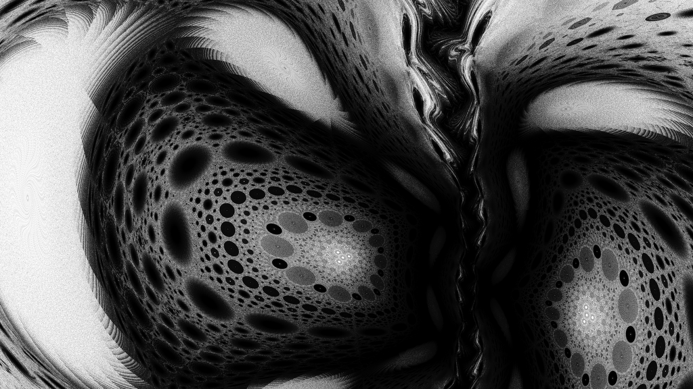
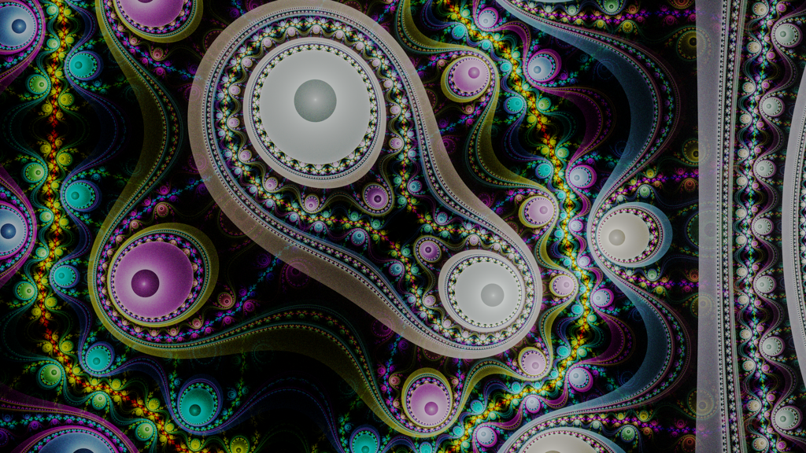
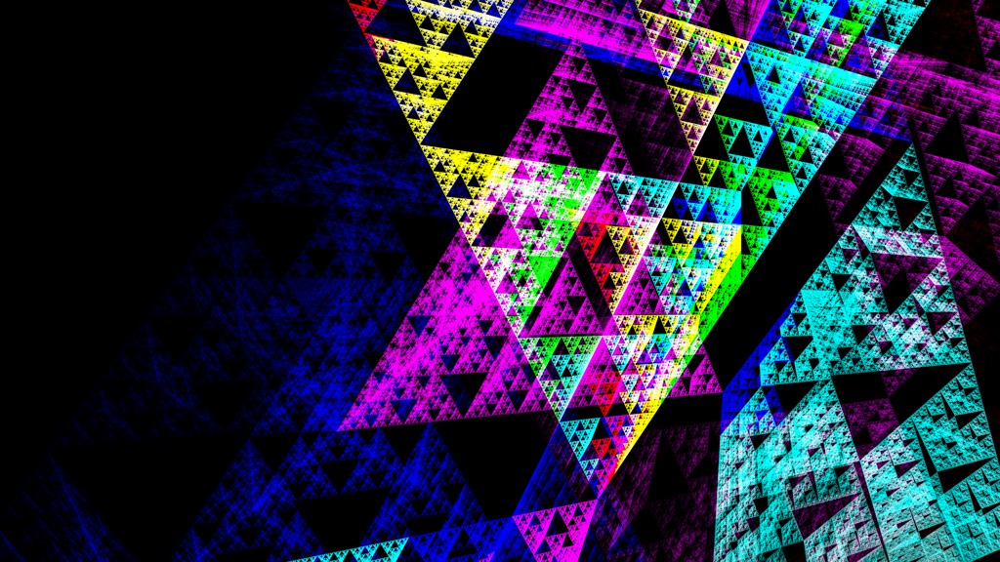

# xirho/img

This directory contains example xirho systems and their rendered outputs. The disc julian, grand julian, and spherical gasket were adapted by hand from templates in Apophysis 7X. The Sierpinski gasket is a well-known IFS. Splits-elliptic was adapted from [Fiery-Fire and SaTaNiA's Apophysis tutorial](https://www.deviantart.com/satania/art/Tutorial-Splits-elliptic-150422119). Calamity is my (zephyrtronium's) own work.

## Calamity

Calamity is an IFS containing only one function. It is presented here primarily to demonstrate xirho's capability to load Flame XML files. But also, it looks cool.

## Disc Julian

Disc Julian is an easy style using only an affine, a disc, and a juliaN. Slightly rotating or shearing the affine before the disc allows for some interesting structural variations. Normally, a Disc Julian is circular, but the polar final re-maps it to a rectangle, and a touch of mobiq bends it for a slight fisheye effect.

## Grand Julian

The Grand Julian style is very easy to create and produces stunning results. Replacing the blur function with another circular one like bubble or even spherical can lead to an even more intricate image.

## Sierpinski Gasket

The Sierpinski gasket was among the earliest fractal shapes to be described, and it is the prototypical example of an iterated function system composed solely of affine transforms. This is a 3D variant with ColorSpeed coloration, but it is otherwise the same classic gasket.

## Spherical Gasket

Spherical is the rather simple function of "reflection about the unit sphere," and combining it with some affines leads to this beautifully intricate fractal. The gasket shape is more precisely this system without the two translated affines and the final; render it to see what it looks like. 😉

## Splits-Elliptic

Splits-elliptic is another classically popular flame style. Since the style is more complicated to implement in xirho than in most other IFS programs, I took the opportunity to create a final transform that is also impossible without xirho's flexibility.
